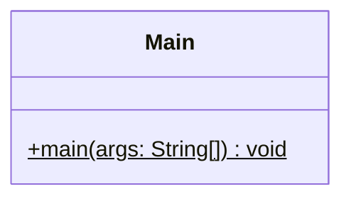

# Proyecto 01 - Hello World

Este proyecto corresponde a la introducción a Java y Maven. Su objetivo es verificar que el entorno de desarrollo funciona correctamente y que el programa puede ejecutarse sin errores.

## ¿Qué hace?

La clase `Main` imprime en consola el texto `Hello World!` para comprobar la configuración básica del proyecto.

## Diagrama de clases

## Estructura de Clases y Relaciones

- La clase `Main` es la entrada principal del programa.
- No hay herencia ni composición en este ejercicio; la lógica es simplemente ejecutar una impresión en consola.
- El proyecto sirve como ejemplo inicial para validar que Java y Maven están correctamente configurados.
