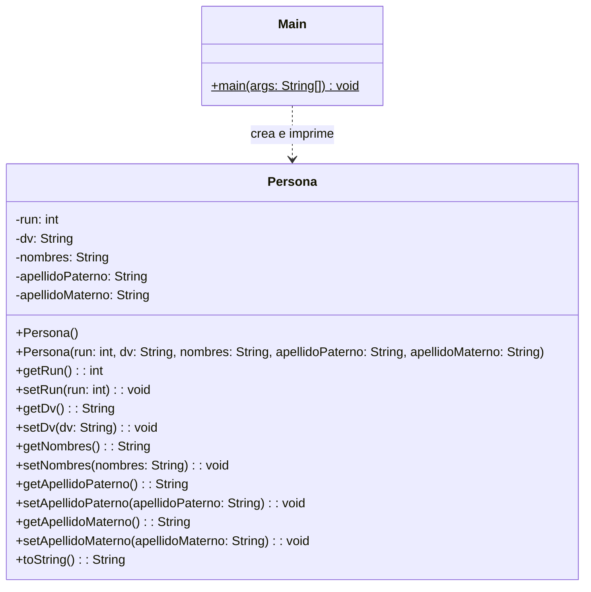

# Proyecto 02 - Abstracción y Encapsulamiento Básico

Este ejercicio introduce los conceptos de encapsulamiento en Java y la definición de una clase de dominio simple.

## ¿Qué hace?

Se crea una clase `Persona` con atributos privados, getters y setters, un constructor vacío, un constructor con parámetros y un método `toString()`. El programa principal instancia personas, les asigna valores y los imprime.

## Diagrama de clases

## Estructura de Clases y Relaciones

- La clase `Persona` encapsula sus atributos con acceso privado y expone métodos de lectura y escritura.
- La clase `Main` crea objetos de tipo `Persona`, les asigna valores y los imprime en consola.
- No hay herencia en este proyecto; la relación principal es de dependencia entre `Main` y `Persona`.
