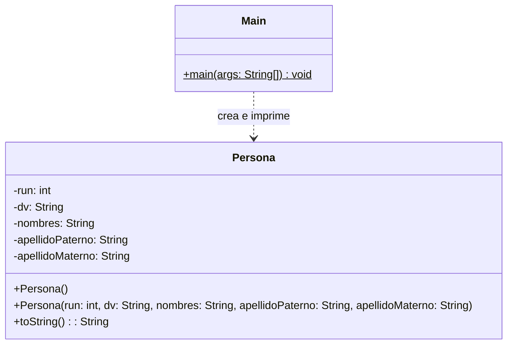

# Proyecto 03 - Encapsulamiento con Lombok

Este proyecto continúa con la práctica de clases y encapsulamiento, pero usando anotaciones de Lombok para generar automáticamente getters, setters, constructores y el método `toString()`.

## ¿Qué hace?

La clase `Persona` guarda datos personales y permite crear instancias con una sintaxis más limpia. El programa principal demuestra la creación y la impresión de objetos de tipo `Persona`.

## Diagrama de clases

## Estructura de Clases y Relaciones

- `Persona` es una clase de dominio que encapsula los datos personales de una persona.
- Lombok genera automáticamente getters, setters y constructores, reduciendo el código repetitivo.
- `Main` mantiene una dependencia directa con `Persona`, ya que crea e imprime objetos del tipo definido.
