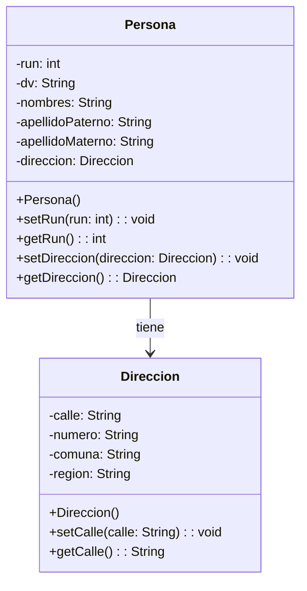

# Proyecto 04 - Diagrama de Clases de Persona y Dirección

Este directorio no contiene clases Java, sino un diagrama de clases en imagen que representa la relación entre una persona y su dirección.

## ¿Qué hace?

El archivo `diagrama-clases.png` muestra el modelo conceptual inicial del sistema: una persona posee una dirección y ambos tipos de datos están representados como clases con atributos y métodos básicos.

## Diagrama de clases

## Estructura de Clases y Relaciones

- El diagrama representa la asociación entre `Persona` y `Direccion`.
- Una persona está compuesta por una dirección o, al menos, tiene una referencia a ella como atributo.
- Este ejercicio sirve como referencia conceptual para la modelación de clases antes de pasar a la implementación Java concreta.
