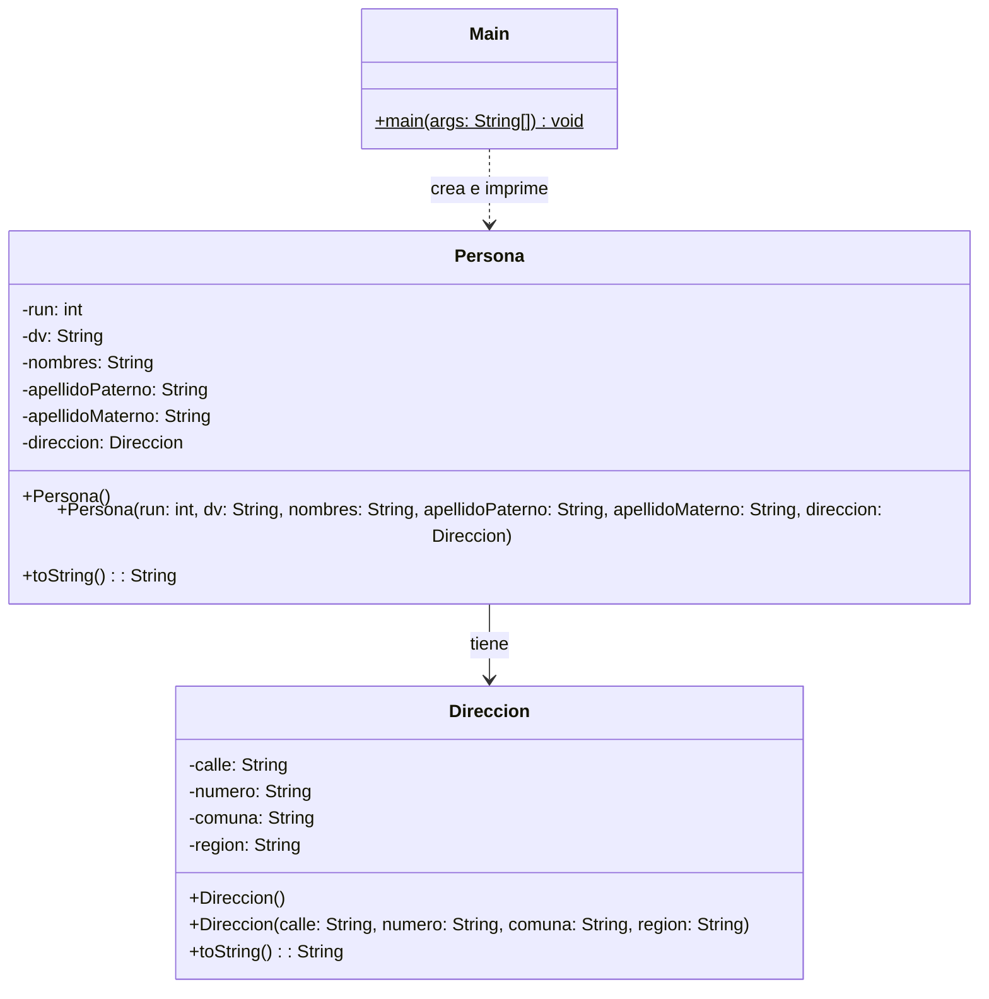

# Proyecto 05 - Persona con Dirección

Este ejercicio refuerza la relación entre entidades del dominio: una `Persona` ahora incluye la clase `Direccion` como atributo.

## ¿Qué hace?

El programa crea personas con datos básicos y asocia a cada una una dirección. Se observa la composición de objetos: una persona tiene una dirección, y la representación en consola muestra la información completa.

## Diagrama de clases

