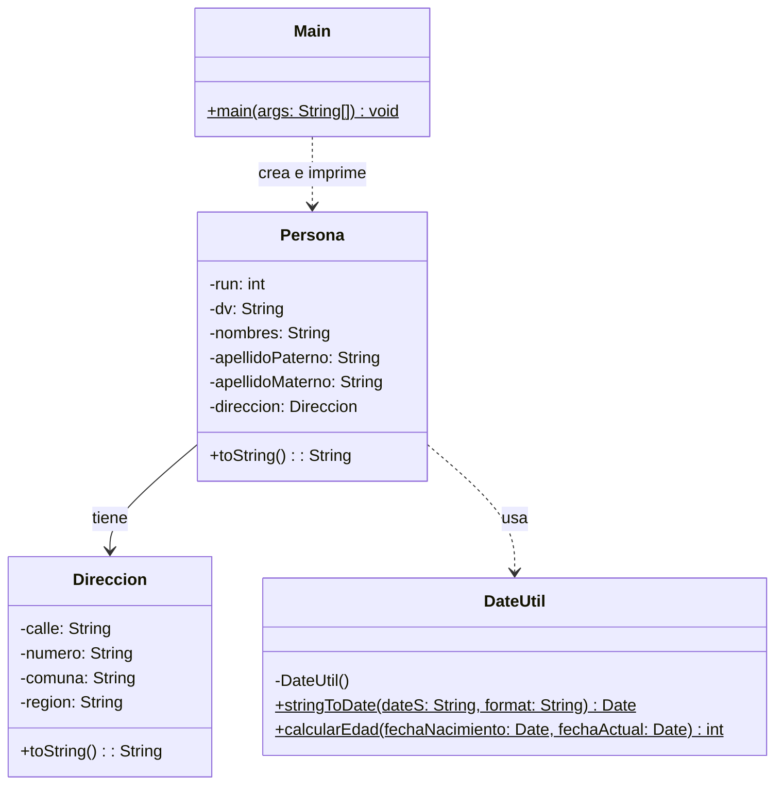

# Proyecto 06 - Persona, Dirección y Utilidades de Fecha

Este proyecto incorpora la gestión de fechas y la validación de edad, además de la relación entre `Persona` y `Direccion`.

## ¿Qué hace?

Se usa una clase utilitaria `DateUtil` para convertir strings a fechas y calcular la edad. La clase `Persona` conserva datos personales y la `Direccion` asociada, y el programa demuestra la manipulación y el procesamiento de esos valores.

## Diagrama de clases

## Estructura de Clases y Relaciones

- `Persona` tiene una asociación con `Direccion`, representando la ubicación de la persona.
- `DateUtil` es una clase auxiliar de dependencia estática, utilizada para convertir fechas y calcular la edad.
- `Main` hace uso de `Persona` para crear instancias con datos reales del dominio y mostrar resultados en consola.
