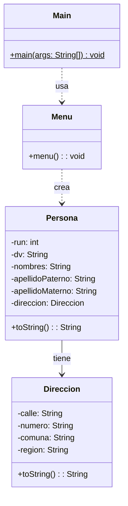

# Proyecto 07 - Menú y Registro de Personas

Este proyecto introduce la primera versión del menú interactivo del curso. La idea principal es capturar los datos de una persona desde la consola y mostrarlos al final.

## ¿Qué hace?

La clase `Menu` permite crear una persona con nombre, apellidos, RUN y dirección. El flujo del programa es simple: se muestran las opciones del menú, se ingresan los datos y luego se imprime el objeto generado.

## Diagrama de clases

## Estructura de Clases y Relaciones

- `Main` inicia la ejecución del programa creando un objeto `Menu`.
- `Menu` es la clase que orquesta la interacción con el usuario y la creación de instancias.
- `Persona` contiene una referencia a `Direccion` para representar la ubicación de la persona.
- Este ejercicio marca el punto de partida del flujo de consola que luego se ampliará con fechas, vehículos y listas.
