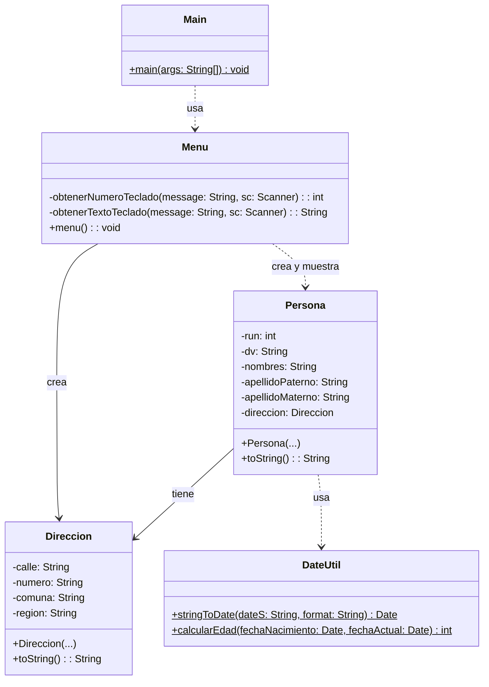

# Proyecto 07 - Menú y Registro de Personas

Este ejercicio agrega interacción con el usuario mediante un menú en consola para crear y listar personas.

## ¿Qué hace?

La clase `Menu` permite ingresar los datos de una persona, crear su dirección y almacenarla en memoria para luego mostrarla. El programa se apoya en una estructura de persona con dirección y en la capa de utilidades para manejar fechas.

## Diagrama de clases

## Estructura de Clases y Relaciones

- `Menu` es la clase que coordina la interacción con el usuario y orquesta la creación de objetos.
- `Persona` y `Direccion` forman una asociación de composición lógica: cada persona tiene una dirección.
- `DateUtil` actúa como clase de utilidad que respalda operaciones relacionadas con fechas.
- `Main` depende de `Menu` para iniciar la ejecución del programa.
