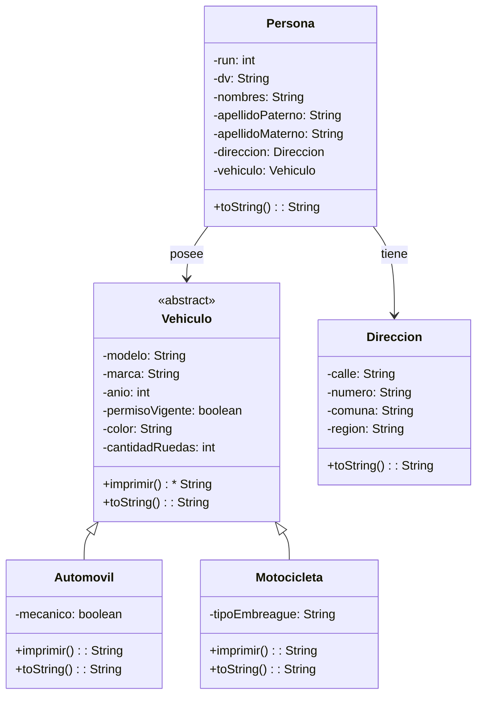

# Proyecto 08 - Herencia de Vehículos

Este proyecto introduce la jerarquía de clases para modelar vehículos. Se define una clase general `Vehiculo` y dos especializaciones: `Automovil` y `Motocicleta`.

## ¿Qué hace?

El sistema representa distintas categorías de vehículo con atributos comunes y específicos, y cada una implementa el comportamiento abstracto `imprimir()`. El programa principal de la práctica permite organizar la relación entre personas y vehículos según el dominio propuesto.

## Diagrama de clases

## Estructura de Clases y Relaciones

- `Vehiculo` es una clase abstracta que define atributos y el método `imprimir()` que deben implementar sus subclases.
- `Automovil` y `Motocicleta` heredan de `Vehiculo`, lo que representa la especialización del dominio.
- `Persona` mantiene dos asociaciones: una con `Direccion` y otra con `Vehiculo`.
- La relación entre `Persona` y `Vehiculo` expresa que una persona puede poseer un vehículo.
