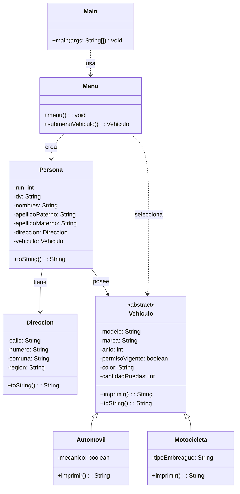

# Proyecto 08 - Herencia de Vehículos

Este proyecto introduce la jerarquía de clases para modelar vehículos. Se define una clase base abstracta `Vehiculo` y dos especializaciones: `Automovil` y `Motocicleta`.

## ¿Qué hace?

El sistema representa distintas categorías de vehículo con atributos comunes y específicos. La clase `Menu` permite crear una persona, asociarle una dirección y elegir el tipo de vehículo que tendrá, además de mostrar la información en la consola.

## Diagrama de clases

## Estructura de Clases y Relaciones

- `Vehiculo` es la clase abstracta que centraliza los atributos y el comportamiento común de todos los vehículos.
- `Automovil` y `Motocicleta` heredan de `Vehiculo` y agregan atributos específicos como `mecanico` o `tipoEmbreague`.
- `Persona` tiene una asociación con `Direccion` y otra con `Vehiculo`, representando el dominio de una persona con su ubicación y transporte.
- `Menu` es el responsable de capturar los datos del usuario y crear las instancias del modelo.
