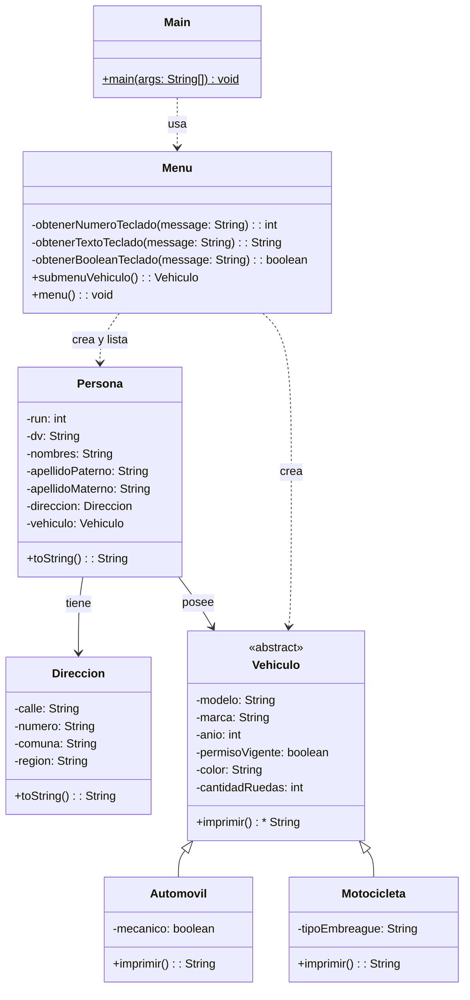

# Proyecto 09 - Vehículos y Menú de Gestión

Este ejercicio combina la herencia de vehículos con un menú interactivo para crear personas y asociarles un vehículo.

## ¿Qué hace?

La clase `Menu` ofrece la posibilidad de seleccionar un tipo de vehículo, completar sus datos y asignarlo a una persona. La aplicación permite gestionar personas que tienen dirección y vehículo, mostrando todo en consola.

## Diagrama de clases

