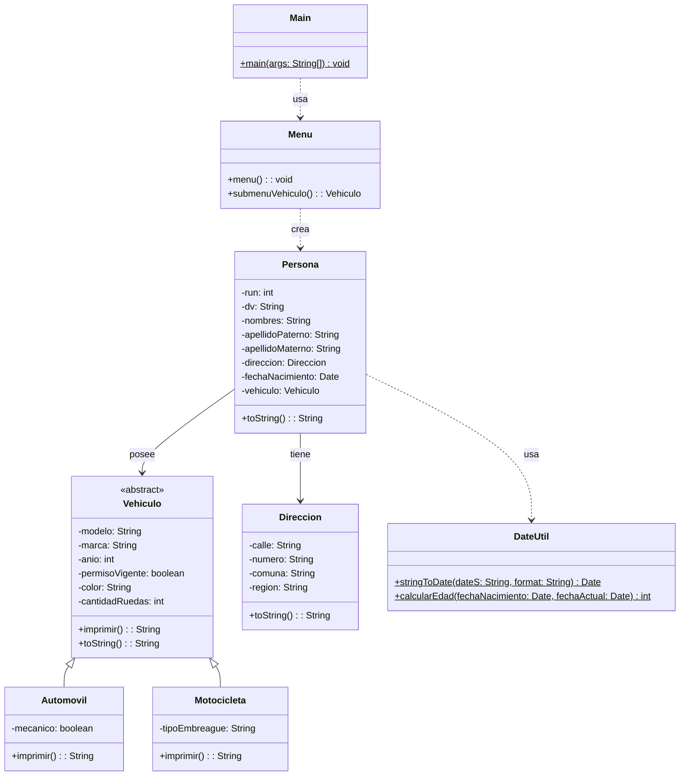

# Proyecto 09 - Vehículos y menú interactivo

Este proyecto combina la herencia de vehículos con un menú interactivo para crear personas y asociarles un vehículo.

## ¿Qué hace?

La clase `Menu` ofrece la posibilidad de seleccionar un tipo de vehículo, completar sus datos y asignarlo a una persona. El programa genera una sola persona a la vez, la guarda en memoria y la imprime en pantalla.

## Diagrama de clases

## Estructura de Clases y Relaciones

- `Menu` es el punto de entrada del sistema y gestiona la creación de `Persona` y su `Vehiculo`.
- `Vehiculo` representa la herencia del dominio y `Automovil`/`Motocicleta` agregan detalle específico.
- `Persona` mantiene una relación con `Direccion`, `DateUtil` y el vehículo asociado.
- El sistema combina herencia, composición y dependencia para modelar una persona con sus datos y transporte.
