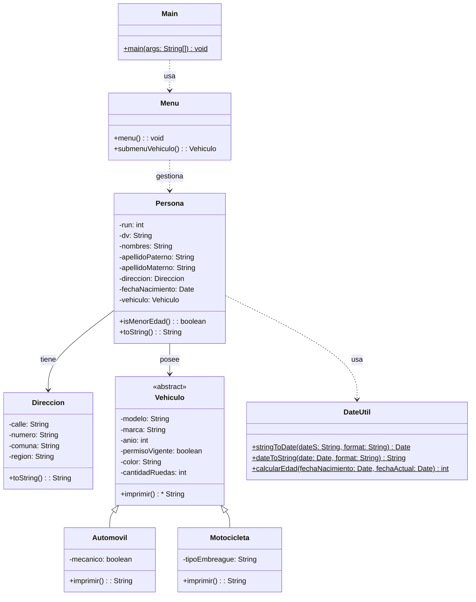

# Proyecto 10 - CRUD Básico de Personas con Vehículos

Este proyecto amplía la lógica de menú para gestionar varios registros de personas y permitir buscar por posición o por RUN.

## ¿Qué hace?

La aplicación crea personas, agrega una dirección y un vehículo, y las almacena en una lista. Desde el menú se pueden listar todas las personas, buscar por índice o por RUN, y continuar interactuando con el sistema.

## Diagrama de clases

## Estructura de Clases y Relaciones

- `Menu` usa listas de `Persona` para registrar y consultar personas por posición o RUN.
- `Persona` agrega el atributo `vehiculo` y `fechaNacimiento`, y mantiene una relación con `Direccion`.
- `Vehiculo` es abstracta y sus clases hijas especializan el comportamiento por tipo de vehículo.
- `DateUtil` centraliza la lógica de fecha y edad, siendo una dependencia del modelo de persona.
