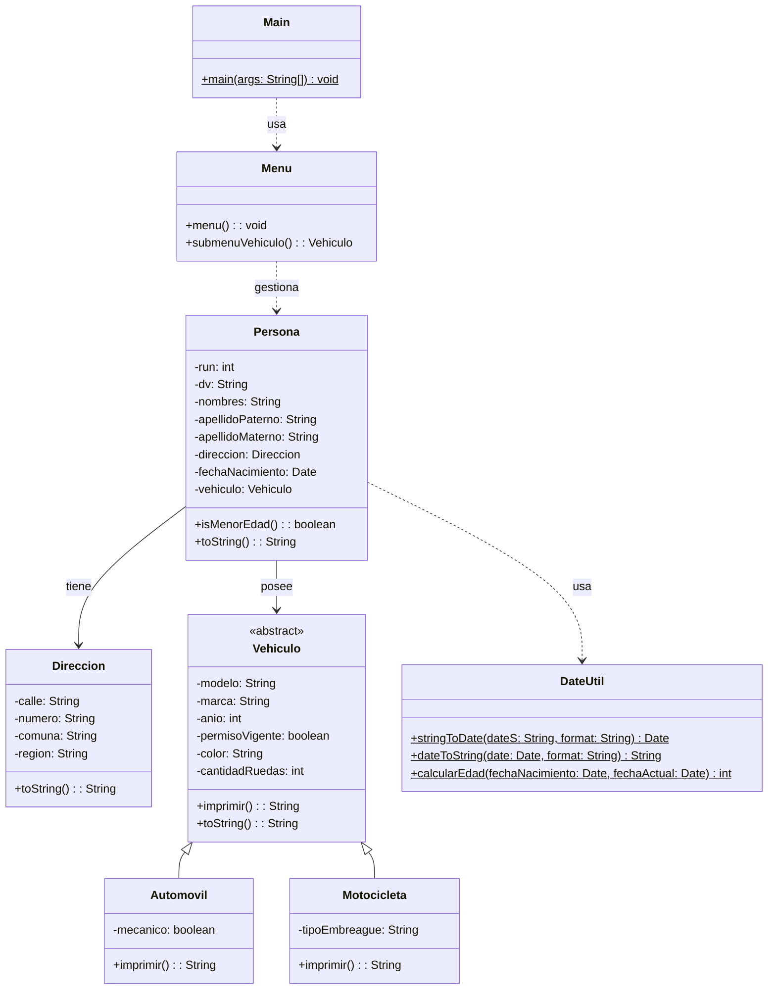

# Proyecto 10 - Creación de persona con Lombok Builder

Este proyecto corrige y refuerza el flujo de creación de una persona usando lombok para construir los objetos y asociarles un vehículo.

## ¿Qué hace?

La aplicación crea una persona con dirección, fecha de nacimiento y vehículo, usando `@Builder` en las clases de dominio para simplificar la construcción de los objetos del sistema.

## Diagrama de clases

## Estructura de Clases y Relaciones

- `Menu` trabaja con una `List<Persona>` para registrar varias personas en memoria.
- `Persona` incorpora `fechaNacimiento` y `vehiculo`, además de una asociación hacia `Direccion`.
- `Vehiculo` es abstracta y se especializa en `Automovil` y `Motocicleta` según la clasificación del dominio.
- `DateUtil` sirve como dependencia auxiliar para convertir fechas y calcular la edad de la persona.
