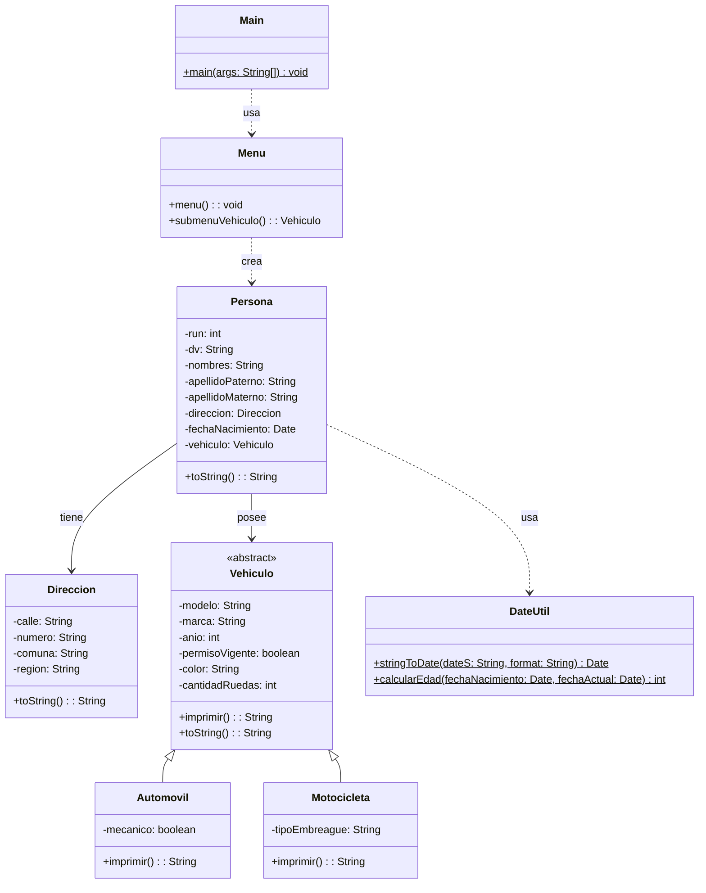

# Proyecto 11 - Persona con dirección, fecha y vehículo

Este proyecto consolida la relación entre la persona y su contexto completo: dirección, fecha de nacimiento y vehículo asociado.

## ¿Qué hace?

La aplicación permite crear una persona con todos sus datos principales, seleccionar un tipo de vehículo desde un submenú, asignárselo y mostrar la información completa en consola. El menú es iterativo y se repite hasta que el usuario sale del sistema.

## Diagrama de clases

## Estructura de Clases y Relaciones

- `Menu` contiene el submenú de vehículos y valida la entrada del usuario mediante métodos auxiliares.
- `Persona` integra `Direccion`, `fechaNacimiento` y `Vehiculo` como parte del modelo de dominio.
- `Automovil` y `Motocicleta` representan dos especializaciones concretas del concepto general `Vehiculo`.
- `DateUtil` brinda soporte para manejar fechas, validaciones y cálculos relacionados con la edad.
