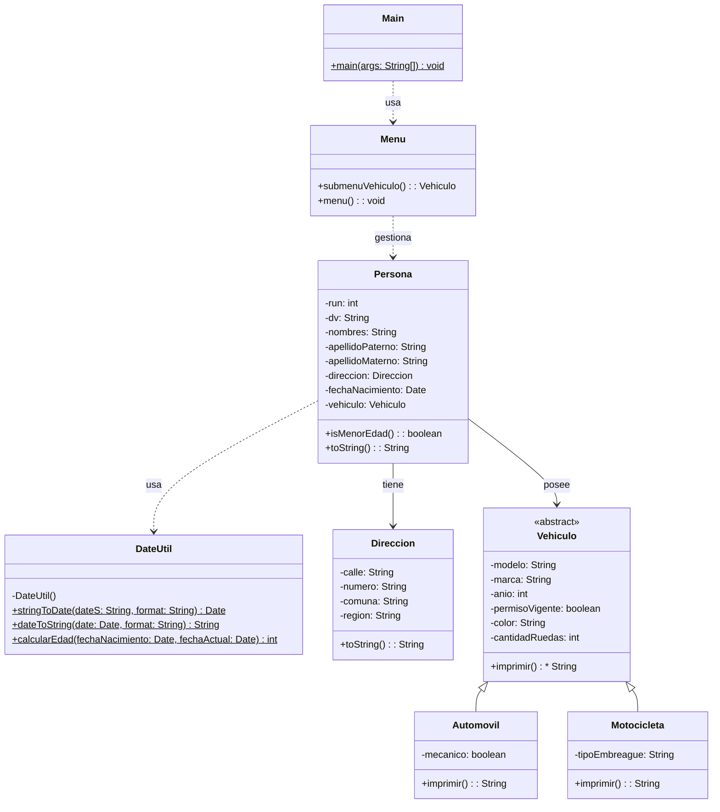

# Proyecto 11 - Gestión de Personas con Vehículos y Validación de Edad

Este proyecto consolida la estructura del sistema de personas, direcciones y vehículos, añadiendo lógica para manejar fechas y evaluar si una persona es menor de edad.

## ¿Qué hace?

La clase `Menu` permite crear personas con su dirección, fecha de nacimiento y vehículo. Luego, las personas se pueden listar, visualizar por posición y buscar por RUN. Además, `Persona` incluye una validación de mayoría de edad mediante `DateUtil`.

## Diagrama de clases

## Estructura de Clases y Relaciones

- El sistema usa herencia para diferenciar `Automovil` y `Motocicleta` bajo `Vehiculo`.
- `Persona` se relaciona con `Direccion` y con `Vehiculo`, además de depender de `DateUtil` para la lógica de edad.
- `Menu` facilita la creación y consulta del conjunto de personas.
- `Main` es el punto de entrada del programa y delega la lógica en `Menu`.
