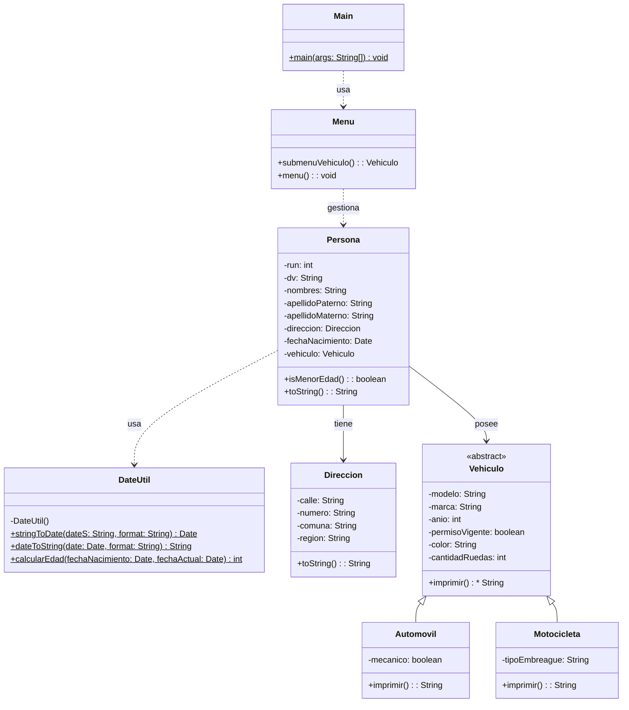

# Proyecto 12 - Sistema Completo de Personas, Dirección, Fecha y Vehículos

Este proyecto representa la versión más completa del curso: el sistema gestiona personas con su dirección, fecha de nacimiento, vehículo asociado y operaciones de búsqueda e impresión.

## ¿Qué hace?

La aplicación permite ingresar múltiples personas desde un menú en consola, crear vehículos de tipo automóvil o motocicleta, asociarlos a la persona y realizar búsquedas por posición y por RUN. También se integra la lógica para determinar si una persona es menor de edad, usando utilidades de fecha.

## Diagrama de clases

