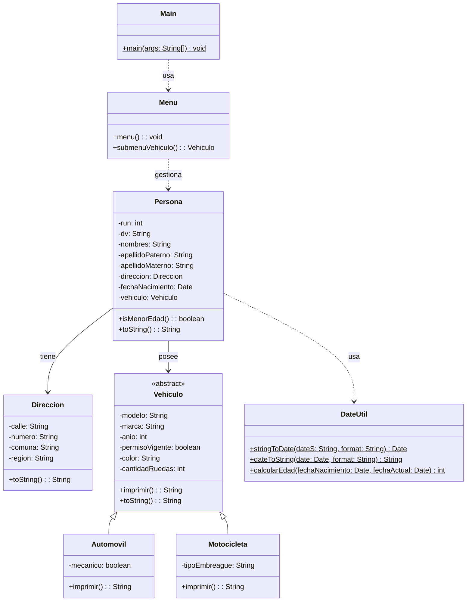

# Proyecto 12 - Listado y búsqueda de personas

Este proyecto refuerza la gestión de varias personas con un menú que permite crearlas, listarlas y buscarlas por posición o RUN.

## ¿Qué hace?

El programa usa una lista de personas para almacenar múltiples registros. El usuario puede ingresar datos de una persona, asociarle una dirección y un vehículo, consultar todos los registros o buscar un elemento específico según su ubicación o run.

## Diagrama de clases

## Estructura de Clases y Relaciones

- `Menu` gestiona una colección de `Persona` y permite navegar por los registros de forma interactiva.
- `Persona` contiene `Direccion`, `fechaNacimiento` y `Vehiculo`, consolidando los conceptos de composición y asociación.
- `Vehiculo` define la jerarquía general, mientras `Automovil` y `Motocicleta` representan especializaciones del dominio.
- `DateUtil` actúa como apoyo para fechas y cálculos asociados a la edad de la persona.
