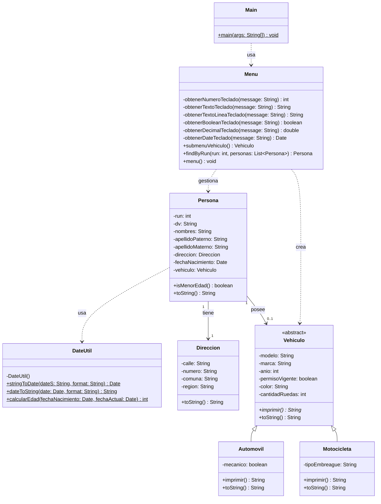

# Proyecto de Gestión de Personas y Vehículos

Este proyecto es una aplicación Java orientada a objetos que permite gestionar personas, sus direcciones y los vehículos asociados a ellas (automóviles o motocicletas).

## Diagrama de Clases UML

A continuación se presenta el diagrama de clases que describe la estructura y las relaciones del sistema:

## Estructura de Clases y Relaciones

- **Herencia**: `Automovil` y `Motocicleta` heredan de la clase abstracta `Vehiculo`.
- **Asociación**: La clase `Persona` contiene referencias a `Direccion` y a `Vehiculo`.
- **Utilidades**: `DateUtil` provee métodos estáticos para la manipulación y formateo de fechas.
- **Interacción**: La clase `Menu` gestiona el flujo de entrada de datos y las operaciones CRUD básicas sobre las personas registradas.