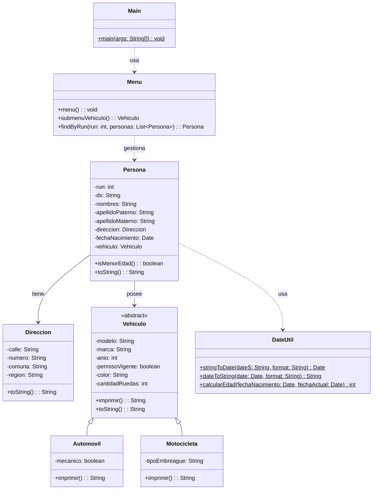

# Proyecto 13 - Búsqueda y eliminación de personas

Este proyecto representa la versión más avanzada del manejo de personas con datos completos, búsqueda por parámetros y eliminación por RUN.

## ¿Qué hace?

El sistema permite registrar varias personas, listarlas, buscar una por posición, buscarla por RUN y eliminarla si corresponde. La estructura combina herencia para vehículos, composición para dirección y utilidades para fechas.

## Diagrama de clases

## Estructura de Clases y Relaciones

- `Menu` incorpora la lógica de interacción con la lista de personas y resuelve búsquedas por `RUN` mediante un método auxiliar.
- `Persona` agrupa `Direccion`, `fechaNacimiento` y `Vehiculo` en una sola entidad del dominio.
- `Vehiculo` ofrece la base abstracta y sus derivaciones concretas representan el tipo de transporte.
- `DateUtil` facilita la manipulación de fechas y el cálculo de edad, siendo una dependencia del modelo de personas.
