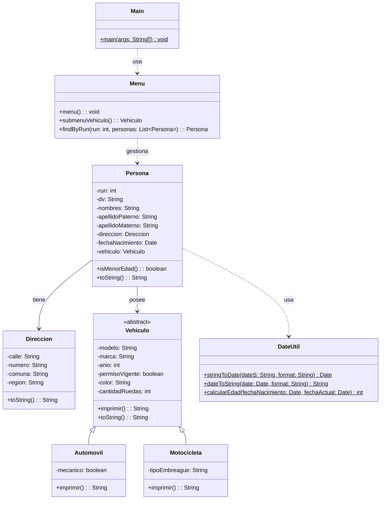

# Proyecto 14 - Búsqueda y eliminación por RUN

Este proyecto continúa la evolución del sistema con una lógica de menú más completa. La clave del ejercicio es buscar personas por RUN y permitir eliminarlas del listado activo.

## ¿Qué hace?

La aplicación gestiona una lista de personas con dirección, fecha, vehículo y búsqueda. El usuario puede crear registros, listarlos, buscar por posición, buscar por RUN, eliminar por RUN y salir del programa.

## Diagrama de clases

## Estructura de Clases y Relaciones

- `Menu` coordina el flujo completo del sistema y encapsula la lógica de búsqueda y eliminación.
- `findByRun` permite localizar una persona dentro de la lista sin depender de la posición del elemento.
- `Persona` modela el estado completo del dominio, incluyendo atributos de ubicación, vehículo y fecha de nacimiento.
- `DateUtil` se usa para transformar strings en `Date` y calcular la edad cuando se requiere.
