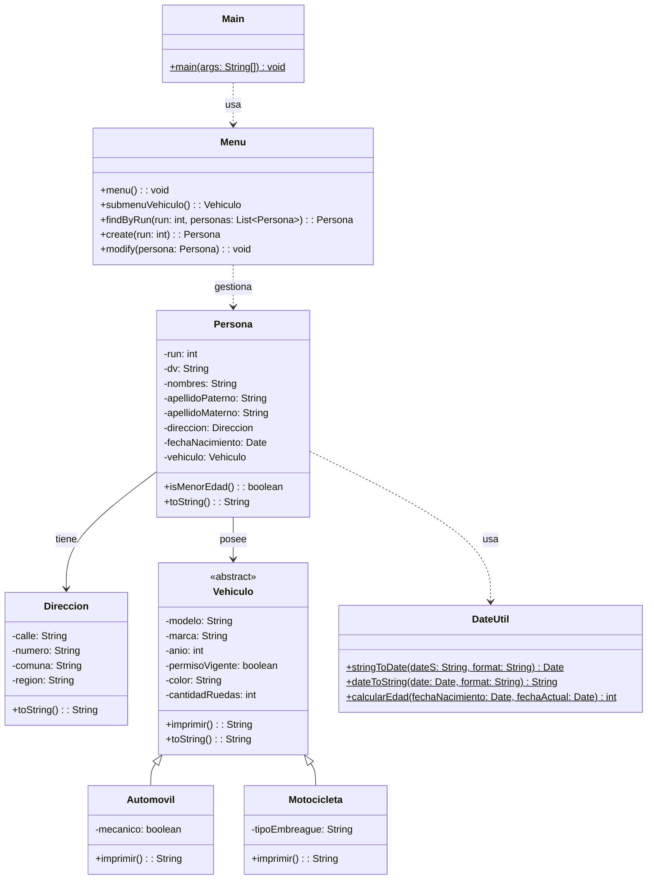

# Proyecto 15 - Actualización por RUN y refactorización

Este proyecto continúa la evolución del sistema con una funcionalidad adicional: buscar una persona por RUN y actualizar sus datos sin perder el flujo principal del programa. Además, se realiza una refactorización del diseño para organizar mejor las clases del dominio y reutilizar lógica.

## ¿Qué hace?

La aplicación gestiona una lista de personas con dirección, fecha de nacimiento, vehículo y validaciones. El usuario puede crear registros, listarlos, buscar por posición, buscar por RUN, eliminar por RUN, actualizar por RUN y salir del programa.

## Diagrama de clases

## Estructura de Clases y Relaciones

- `Menu` coordina el flujo completo del sistema y encapsula la lógica de búsqueda, eliminación y actualización.
- `findByRun` permite localizar a una persona dentro de la lista sin depender de la posición del elemento.
- `create` centraliza la captura de datos y la construcción del objeto `Persona` con su `Direccion` y su `Vehiculo`.
- `modify` permite actualizar los atributos de una persona ya existente a partir del RUN encontrado, evitando duplicar la lógica del registro.
- `Persona` modela el estado completo del dominio, incluyendo atributos de ubicación, vehículo y fecha de nacimiento.
- `DateUtil` transforma strings en `Date` y calcula edades para lógica de validación.
- La refactorización separa las entidades del dominio en `cl.profecarreno.dto`, dejando utilidades y flujo principal más ordenados y mantenibles.
